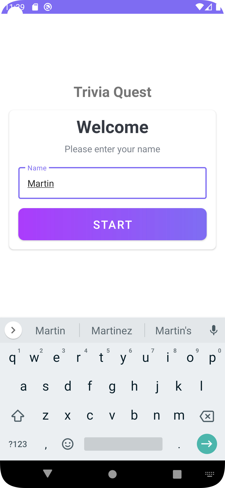
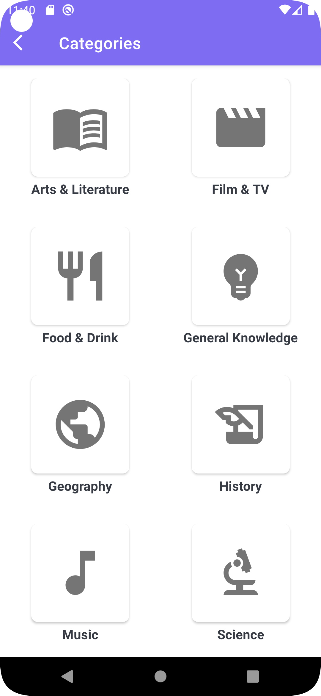
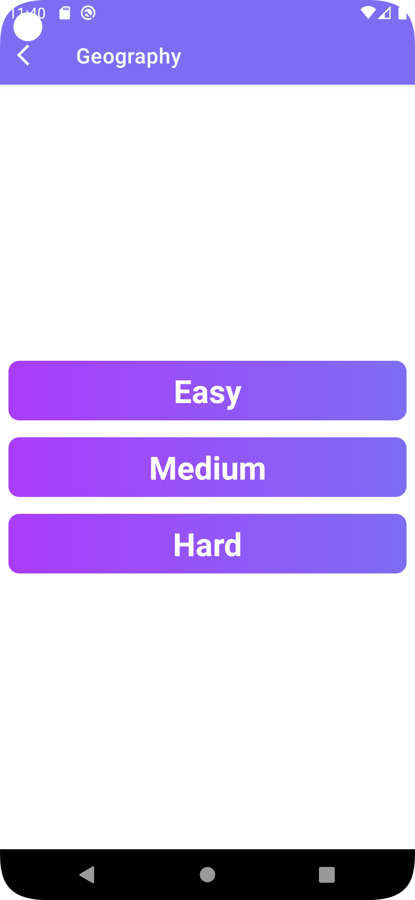
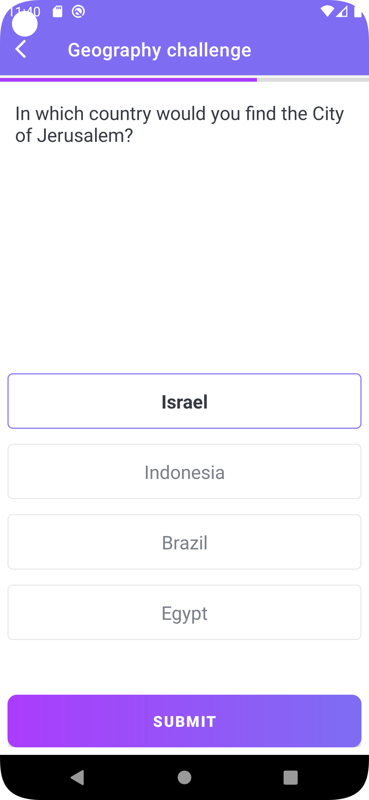
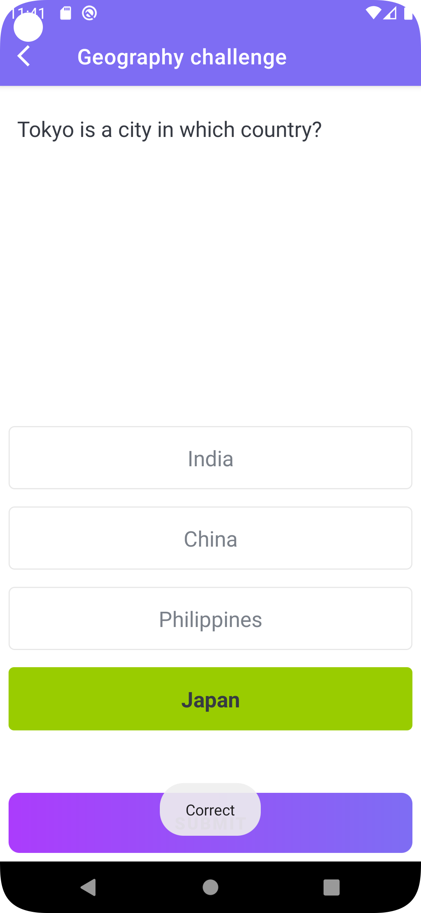
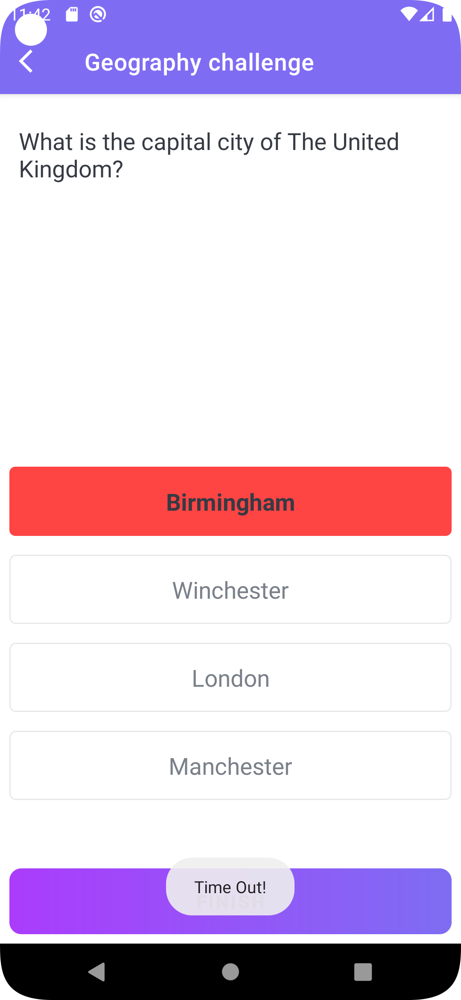

# Trivia Quest 

## Author

## *[Martin Thuo](https://twitter.com/mertoenjosh)*

**Trivia Quest** is a quiz application with several categories and three levels of difficulties. It uses retrofit to consume a RESTful API.
Challenge yourself on how much you know be selecting either of the category.

## Features

- Pure Kotlin
- Retrofit and Gson converter

## Screenshots

   
   

[comment]: <> ( )

[comment]: <> (![Welcome Screen]&#40;src/Screenshot_20220624_113929-welcome.png&#41;)

[comment]: <> (![Category Screen]&#40;src/Screenshot_20220624_114005-cat.png&#41;)

[comment]: <> (![Difficulty Screen]&#40;src/Screenshot_20220624_114032-diff.png&#41;)

[comment]: <> (![Selected Screen]&#40;src/Screenshot_20220624_114057-sel.png&#41;)

[comment]: <> (![Correct Screen]&#40;src/Screenshot_20220624_114134-cor.png&#41;)

[comment]: <> (![Timeout Screen]&#40;src/Screenshot_20220624_114218-timout.png&#41;)

## License

    Copyright 2022 Martin Thuo

    Licensed under the Apache License, Version 2.0 (the "License");
    you may not use this file except in compliance with the License.
    You may obtain a copy of the License at

        http://www.apache.org/licenses/LICENSE-2.0

    Unless required by applicable law or agreed to in writing, software
    distributed under the License is distributed on an "AS IS" BASIS,
    WITHOUT WARRANTIES OR CONDITIONS OF ANY KIND, either express or implied.
    See the License for the specific language governing permissions and
    limitations under the License.
